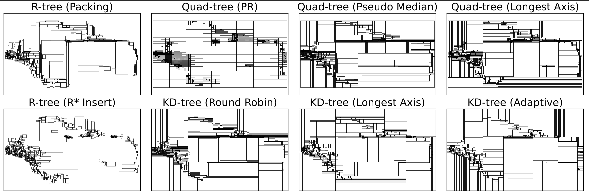
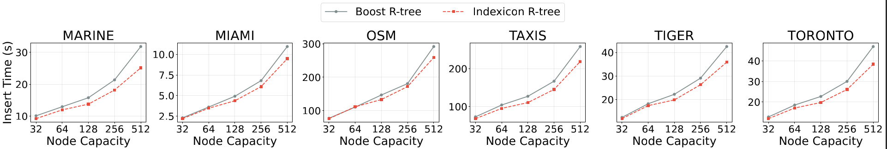
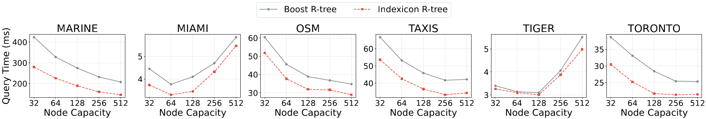

# Indexicon

I often must modify or benchmark a spatial index. Unfortunately, most implementations are *Cthulhian dependency tangles* or lack features. That's why I made **Indexicon**, a drop-in spatial index library with top-tier performance.

### Features
- Includes R-tree, Quad-tree, and KD-tree variants.
- Unified API for bulk loading, insertion, deletion, range queries, kNN queries, and statistics.
- Supports point and minimum bounding box (MBB) data.
- Dependency-free single-header implementations in C++.

## Quick Start

To compile and test all indexes:

```bash
cd test
bash run_all.sh
```

## Indexes

| Index | File | Dims | Data Type | Description |
| :--- | :--- | :---: | :---: | :--- |
| **R-tree** | `rtree_point.hpp`, `rtree_mbr.hpp` | Any | Point / MBB | An R-tree implementation supporting decoupled internal and leaf node capacities. It features top-down bulk loading (via longest-axis median bisection) and R* insertions with forced reinsertions and margin-minimizing splits. Deletions dissolve sparse nodes and reinsert orphans. `rtree_point.hpp` and `rtree_mbr.hpp` are nearly identical implementations for point and MBR data, respectively. |
| **Quad-tree** | `quadtree.hpp` | 2D | Point | A Quad-tree supporting three splitting strategies: Point-Region (PR) (geometric midpoints), Pseudo-median (independent axis medians), and Longest-axis (median of the widest span). It features bulk-loading, automatic expansion with re-rooting for out-of-bounds insertions, and leaf overflowing to prevent infinite recursion from duplicate points. |
| **MX-CIF Quad-tree** | `mxcif_quadtree.hpp` | 2D | MBB | An MX-CIF variant of the Quad-tree utilizing the PR splitting strategy. It efficiently handles spatial extents by storing boundary-straddling MBBs in internal nodes, while non-straddling MBBs are stored in bucket leaves. |
| **Oct-tree** | `octtree.hpp` | 3D | Point | A 3D extension of the PR Quad-tree that recursively divides space into eight equal octants at the midpoint of each axis. |
| **KD-tree** | `kdtree.hpp` | Any | Point | A KD-tree utilizing binary space partitioning and bucket leaves. The splitting dimension is chosen dynamically via Adaptive (widest data spread), Round-robin (depth cycling), or Longest-axis (widest bounding box) strategies. Bulk-loading recursively halves data at the median coordinate. Dynamic insertions trigger local leaf splits without global rebalancing, while deletions merge underflowing sibling leaves. |

All indexes support: packing, insertion, deletion, range queries, kNN, and statistics.

### Partitioning Examples

A visual representation of how each index partitions the same data



### R-tree Benchmarks

A benchmark of Indexicon's R-tree against Boost's R-tree on insertion and range query times for various node capacities.






## Manual Compilation

### Project Structure
- `indexes/`: index implementations.
- `test/rtree/`: R-tree point and MBR examples in 2D and 3D.
- `test/quadtree/`: Quad-tree point examples, MX-CIF Quad-tree MBR examples, and Oct-tree examples.
- `test/kdtree/`: KD-tree point examples in 2D and 3D.
- `data/`: sample data.

Requirements: a C++17-compatible compiler.

**Compile and run a single test:**
```bash
cd test
g++ -std=c++17 -O2 -o rtree/rtree_point_2d.exe rtree/rtree_point_2d.cpp
./rtree/rtree_point_2d.exe
```

The tests are also the best usage examples. Each one shows the full flow for an index: load data, bulk load, insert, delete, range query, kNN query, and statistics.

## Data

Datasets and query files can be downloaded [here](https://drive.google.com/drive/folders/1rHr9DKvwj_ic5JhOkfwQOHcqIt1_FgjQ?usp=sharing). 
You can generate your own queries using the query generator provided.

| Dataset | Records | Type | Size | Dims | Dupl. | Description |
| :--- | ---: | :--- | ---: | :---: | ---: | :--- |
| MARINE | 25.0M | Point | 716.2 MB | 3D | 0.01% | US coastal vessel tracking data |
| MIAMI | 3.5M | MBB | 312.2 MB | 3D | 0.02% | Urban traffic-object MBBs in Miami |
| OSM | 103.5M | Point | 2.0 GB | 2D | 0.03% | Geolocations in Central America |
| TAXIS | 112.8M | Point | 2.2 GB | 2D | 14.55% | NYC Taxi pickup geolocations |
| TIGER | 17.9M | MBB | 715.2 MB | 2D | 5.60% | Lower 48 street MBBs |
| TORONTO | 21.6M | Point | 679.5 MB | 3D | 6.94% | Toronto urban LiDAR point cloud |


## Contributing
Contributions are welcome. Before submitting a pull request, please ensure you follow the design rules:
1. **No dependencies**: indexes rely solely on C++ standard library.
2. **Templates**: indexes can be adapted to different data types.
3. **Single-header**: every index is a standalone `.hpp` file.

When adding a new index, please include:
- The index implementation under `indexes/`.
- One working example under `test/`.
- A short description in the README.
- Support for the common API where applicable (e.g., bulk loading).

*Hopefully, **Indexicon** will grow into a grimoire of indexes, expanded by those brave enough to peer into the geometry of the unknown.*

## License

This project is licensed under the MIT License. See [LICENSE](LICENSE) for details.

## Citation

If you use Indexicon in a project, paper, benchmark, or product, please cite:

```bibtex
@misc{simatis2026indexiconspatialindexinglibrary,
      title={Indexicon: A Spatial Indexing Library}, 
      author={Panagiotis Simatis and Panagiotis Bouros and Nikos Mamoulis},
      year={2026},
      eprint={2606.04676},
      archivePrefix={arXiv},
      primaryClass={cs.DB},
      url={https://arxiv.org/abs/2606.04676}, 
}
```

The accompanying paper is available on arXiv: https://arxiv.org/abs/2606.04676