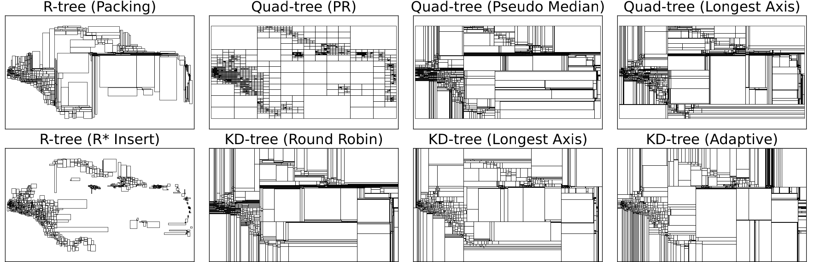
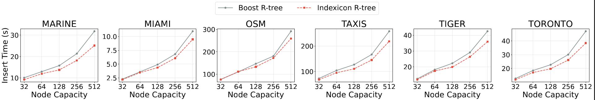
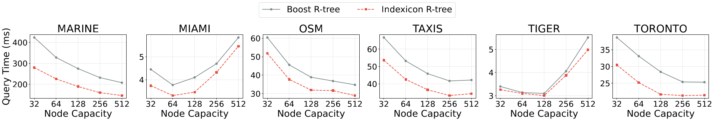

[](https://arxiv.org/abs/2606.04676)

# Indexicon

I often must modify or benchmark a spatial index. Unfortunately, most implementations are complex or lack features. That's why I made Indexicon, a drop-in library with state-of-the-art performance. It features:
- Highly efficient R-tree, Quad-tree, and KD-tree single-header C++ implementations.
- A unified API for packing, insertion, deletion, range queries, kNN queries, and statistics.
- Native support for point and minimum bounding box (MBB) data.

## Quick Start

To compile and test all indexes:

```bash
./test/run_all.sh
```

## Indexes



| Index | File | Dims | Data Type | Description |
| :--- | :--- | :---: | :---: | :--- |
| **R-tree** | `rtree_point.hpp`, `rtree_mbr.hpp` | Any | Point / MBB | It decouples internal and leaf node capacities. It features top-down packing, R* insertions, and deletions that dissolve sparse nodes and reinsert orphans. `rtree_point.hpp` and `rtree_mbr.hpp` are implementations for point and MBB data, respectively. |
| **Quad-tree** | `quadtree.hpp` | 2D | Point | It supports three splitting strategies: Point-Region (PR) (geometric midpoints), Pseudo-median (independent axis medians), and Longest-axis (median of the widest span). It features bulk-loading, out-of-bounds insertions, and leaf overflows to handle duplicate points. |
| **MX-CIF Quad-tree** | `mxcif_quadtree.hpp` | 2D | MBB | It uses PR splits and stores boundary-straddling MBBs in internal nodes. |
| **Oct-tree** | `octtree.hpp` | 3D | Point | 3D extension of the PR Quad-tree dividing space into equal octants. |
| **KD-tree** | `kdtree.hpp` | Any | Point | It supports bucket leaves and three splitting strategies: Round-robin, Adaptive (widest data spread) , and Longest-axis (widest bounding box). Packing recurisevely halves data at the median coordinate. Insertions/deletions handle leaf overflows/underflows. |


### R-tree Benchmark

Indexicon against Boost on insertion and range query times for various node capacities.





> **Note:** For a comprehensive benchmark including all indexes, refer to our [paper](https://arxiv.org/abs/2606.04676).


## Manual Compilation

### Project Structure
- `indexes/`: index implementations.
- `test/rtree/`: R-tree point and MBR examples in 2D and 3D.
- `test/quadtree/`: Quad-tree point examples, MX-CIF Quad-tree MBR examples, and Oct-tree examples.
- `test/kdtree/`: KD-tree point examples in 2D and 3D.
- `data/`: sample data.

Requirements: a C++17-compatible compiler.

**Compile and run a single test:**
```bash
cd test
g++ -std=c++17 -O2 -o rtree/rtree_point_2d.exe rtree/rtree_point_2d.cpp
./rtree/rtree_point_2d.exe
```

The tests are the best usage examples. Each one shows the full flow for an index: load data, bulk load, insert, delete, range query, kNN query, and statistics.

## Data

Datasets, query files, and query generators can be downloaded [here](https://drive.google.com/drive/folders/1rHr9DKvwj_ic5JhOkfwQOHcqIt1_FgjQ?usp=sharing).

| Dataset | Records | Type | Size | Dims | Dupl. | Description |
| :--- | ---: | :--- | ---: | :---: | ---: | :--- |
| MARINE | 25.0M | Point | 716.2 MB | 3D | 0.01% | US coastal vessel tracking data |
| MIAMI | 3.5M | MBB | 312.2 MB | 3D | 0.02% | Urban traffic-object MBBs in Miami |
| OSM | 103.5M | Point | 2.0 GB | 2D | 0.03% | Geolocations in Central America |
| TAXIS | 112.8M | Point | 2.2 GB | 2D | 14.55% | NYC Taxi pickup geolocations |
| TIGER | 17.9M | MBB | 715.2 MB | 2D | 5.60% | Lower 48 street MBBs |
| TORONTO | 21.6M | Point | 679.5 MB | 3D | 6.94% | Toronto urban LiDAR point cloud |

## Contributing
Contributions are welcome. Before submitting a pull request, please ensure the following:
1. **No dependencies**: indexes rely solely on C++ standard library.
2. **Templates**: indexes can be adapted to different data types.
3. **Single-header**: every index is a standalone `.hpp` file.

*Hopefully, Indexicon will grow into a grimoire of indexes, expanded by those brave enough to peer into the geometry of the unknown.*

## License

This project is licensed under the MIT License. See [LICENSE](LICENSE) for details.

## Reference

If you use Indexicon in a project, paper, benchmark, or product, please cite:

```bibtex
@misc{simatis2026indexiconspatialindexinglibrary,
      title={Indexicon: A Spatial Indexing Library}, 
      author={Panagiotis Simatis and Panagiotis Bouros and Nikos Mamoulis},
      year={2026},
      eprint={2606.04676},
      archivePrefix={arXiv},
      primaryClass={cs.DB},
      url={https://arxiv.org/abs/2606.04676}, 
}
```

Indexicon's paper is available on arXiv: https://arxiv.org/abs/2606.04676
